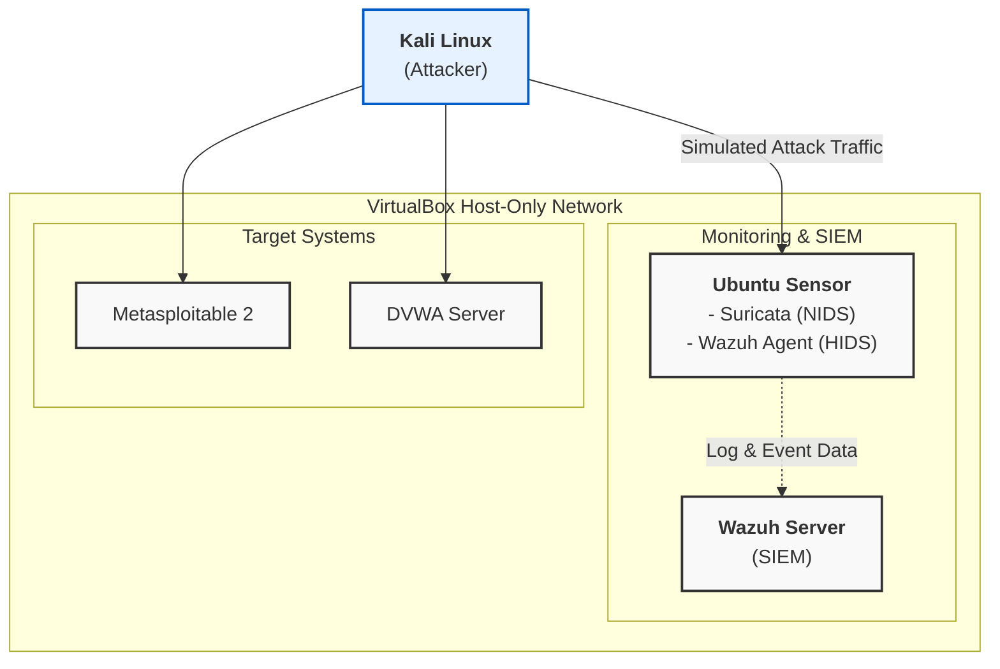

# Advanced Cybersecurity Home Lab with Suricata & Wazuh

  

This repository documents the architecture and function of a multi-layered cybersecurity home lab. The environment is designed to simulate, detect, and analyze cyber threats using a combination of a Network Intrusion Detection System (**NIDS**) and a Host-based Intrusion Detection System (**HIDS**) integrated with a centralized Security Information and Event Management (**SIEM**) platform. 🛡️

---

## Lab Architecture Diagram

The diagram below illustrates the flow of attack traffic and security data within the virtualized network.

---

## Core Components

* **Kali Linux (Attacker):** An offensive security distribution used to launch simulated attacks, including network reconnaissance, vulnerability scanning, and exploitation.
* **Ubuntu Server (Sensor):** The network's watchdog, this server is configured in promiscuous mode to monitor all traffic.
    * **Suricata (NIDS):** Inspects network packets in real-time, using signature-based rules to detect known threats, scans, and malicious payloads.
    * **Wazuh Agent (HIDS):** Monitors the sensor host itself, collecting logs, checking for rootkits, and monitoring file integrity.
* **Wazuh Server (SIEM):** The central brain of the lab. It ingests, analyzes, and correlates security data from the Wazuh agent, providing a unified dashboard for alert triage and incident investigation.
* **Target Systems (Victims):** Purposefully vulnerable servers that act as the targets for simulated attacks.
    * **Metasploitable 2:** A well-known vulnerable Linux VM designed for security training.
    * **DVWA Server:** A server hosting the Damn Vulnerable Web Application for practicing web-based exploits.

---

## Technologies Used

* **Virtualization:** Oracle VirtualBox
* **NIDS Engine:** Suricata
* **HIDS & SIEM:** Wazuh
* **Sensor OS:** Ubuntu Server
* **Attacker OS:** Kali Linux
* **Vulnerable Targets:** Metasploitable 2, DVWA
* **Pentesting Tools:** Nmap, Metasploit Framework

---

## Attack Scenarios & Detection

The following are examples of attacks performed in the lab to test its detection capabilities.

### Scenario 1: Network Reconnaissance 📡

A TCP SYN "stealth" scan was launched from the Kali machine to identify open ports on the Metasploitable 2 server.

* **Detection:** Suricata successfully flagged the scan, triggering the **"ET SCAN NMAP OS Detection Probe"** alert, which was forwarded to the Wazuh server for analysis.

### Scenario 2: Web Server Exploitation 💥

A known command injection vulnerability in the Damn Vulnerable Web Application (DVWA) was exploited using tools on the Kali machine to gain shell access.

* **Detection:** The malicious HTTP POST request containing the payload was identified by Suricata's rule set, generating a high-severity alert for a web-based attack.

---

## Skills Demonstrated

This project provides hands-on experience with tools and procedures used daily in a Security Operations Center (SOC).

* **Security Tool Integration:** Deployed and configured Suricata (NIDS) and Wazuh (HIDS/SIEM) to create a multi-layered defense system.
* **Threat Detection & Analysis:** Utilized Suricata for signature-based network threat detection and Wazuh for host-level log analysis and threat intelligence.
* **Incident Simulation:** Executed penetration testing techniques (reconnaissance, exploitation) to generate realistic security alerts and test defensive postures.
* **SIEM Operations:** Gained practical experience using a SIEM dashboard to investigate, correlate, and triage security alerts from disparate sources.
